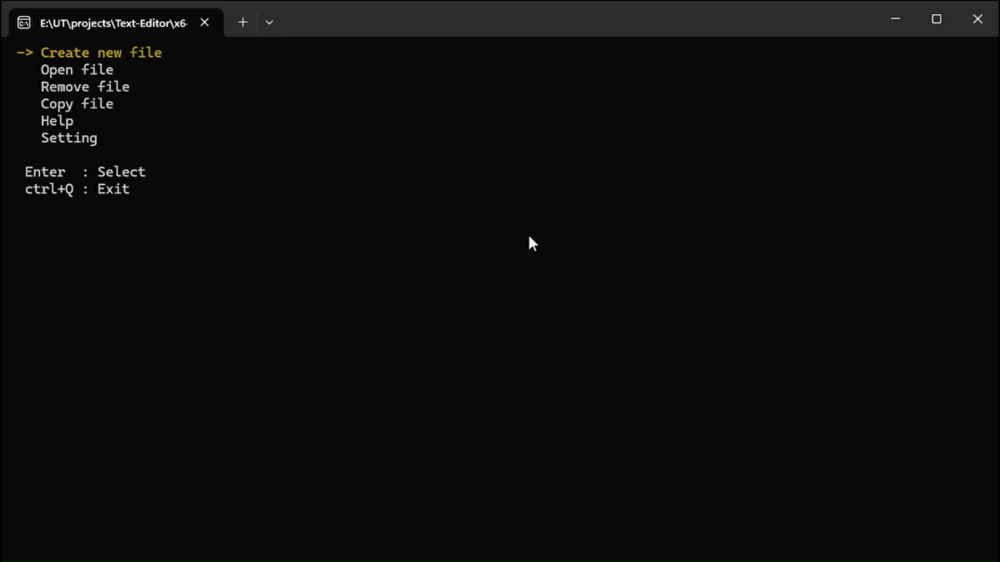

<h1 align="center">Text Editor (C++ Console Application)</h1>

<p align="center">
A modular console-based text editor written in C++, built using object-oriented design and the Windows Console API.
<br>
This project demonstrates low-level keyboard input handling, cursor management, file system operations, and customizable console rendering.

</p>

## Demo

<p align="center">
  
  <br>
  <em>Some features of the Text Editor in action.</em>
</p>


## Features  
### File Management
- Create new file
- Open existing file
- Remove file
- Copy file to another path

Root directory : ```./TextEditor/```

### Text Editing
- Insert and edit text
- Save file (Ctrl + S)
- Search text (Ctrl + F)
- Select text (Shift + Arrow Keys)
- Copy (Ctrl + C)
- Cut (Ctrl + X)
- Paste (Ctrl + V)
- Delete line (Ctrl + L)
- Duplicate line (Ctrl + D)

### Customization (Settings Menu)
- Change text printing color
- Change quotation color
- Change text selection color
- Change search match color

### Navigation
- Keyboard-driven interface
- Arrow key navigation
- Escape to return to menu
- Ctrl + Q to exit

## Project Structure
```
TextEditor/
│
├── main.cpp
├── Console.cpp / Console.h
├── Cursor.cpp / Cursor.h
├── Editor.cpp / Editor.h
├── File.cpp / File.h
├── TextEditor.vcxproj
│
TextEditor.sln
```

## Project Architecture
The project is organized into four main components with clear responsibilities.

### Editor (Application Controller)
- Editor is the main orchestrator of the program. It owns the application state (colors, menu option, selection state, search state) and manages the high-level flow

### File (Document Model + File System Operations)
- File represents the currently opened document and contains the editable text data and file-related operations

### Console (Rendering / UI Layer)
- Console is responsible for printing and updating the console UI using the Windows Console API.

### Cursor (Cursor & Navigation Utilities)
- Cursor provides low-level cursor control helpers.

--- 

### High-Level Flow
1. main.cpp creates an Editor instance.

2. Editor shows the menu and handles user input.

3. When a file is opened:
    - File loads the content into memory (temp_content_)
    - Console renders the editor view

4. During editing:
    - Editor captures key presses
    - File updates the content model
    - Console refreshes only the affected lines and highlights when needed
    - Cursor controls navigation and selection movement

```
main.cpp
  └── Editor (controller)
        ├── File (document model + IO)
        ├── Console (rendering + highlighting)
        └── Cursor (cursor utilities)

```

## How to Build
1. Open TextEditor.sln in Visual Studio
2. Select __Release__ mode
3. Select __x64__
4. Click __Build__ → __Build Solution__

- Executable will be generated in: ``` x64/Release/ ```
- Running the Application : ```TextEditor.exe```

## Download

Prebuilt Windows x64 executable: [Download Text Editor v1.0.0](https://github.com/masoudmoraa/TextEditor/releases/tag/v1.0.0)

